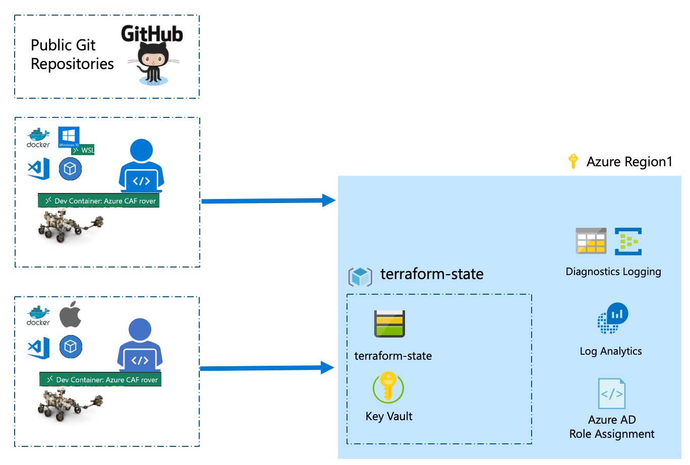

# Landing zone - launchpad open source light

The open source launchpad light provides the basic capabilities required to enable your infrastructure as code environment on Azure to deploy the Cloud Adoption Framework Terraform landing zones.

It is a foundational set of service from a security, governance and provisioning perspective that will take ownership of the lifecycle management of your landing zones. Apart from the Azure running costs the open source launchpad does not require a specific license to run. The project is supported by the open source community and you can fill issues to request new features or report a defect.

The main objective of the launchpad open source light is:

* Secure remote state management

## Architecture Diagram

The following components are deployed by the opensource_light launchpad:

## Requirements

To support the features set of the open source light launchpad you need to get:

| Access context | Required privileges |
| -------------- | --------------------|
| Subscription   | Contributor Role    |

## Supported type of subscriptions

The open source light launchpad has been tested on:
- Azure Pass
- Trial
- MSDN Subscriptions
- Microsoft AIRS (Microsoft Internal Field Subscriptions)
- Enterprise Agreement
- CSP

## Remote state management

The open source light launchpad stores all landing zones states into a geo-replicated Azure storage account. You can initialize the launchpad using the CAF rover dev container toolbox. The CAF rover is a versioned container that contains the launchpad and rover command.

When you initialize the launchpad you need to define an Azure region. This Azure region will be the primary region used to store the remote state and any related secrets and keys.

The following services are deployed:

- **Storage account**: stores all landing zones Terraform states
- **Virtual network**: isolates the traffic between the different services like storage account, Key Vault.
- **Key Vault**: Azure HSM to store the secrets generated by the launchpad. Various access policies are defined on the Key Vault to restrict access to the rover and the logged-in user (authenticated in the rover).

Not finding your feature, fill an issue to document it and start contributing by submitting a PR

Ready to give it a go in your environment? Read the on-boarding guide

Interested in improving the open source launchpad? Read the following developer guide.